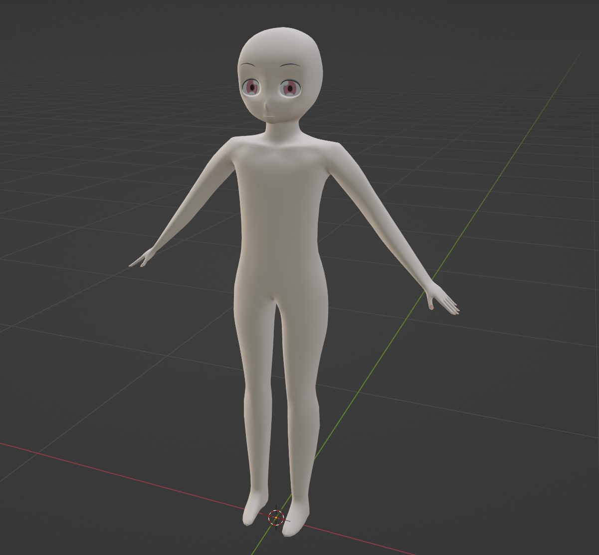

# Vanilla flavored human body (blender model)

[](.github/image.jpg)

## Features

You can derive this model to create your own one!

- Basic human body:
  - Body mesh
  - Armatures + Bones
  - Weight painted
- Vanilla flavored human:
  - No age. Adjust body proportions by your self.
  - No sex/gender. Not a male. Not a female. Not any sexuality.
  - No ear. Friendly for kemo-mimis or elf-ears.
  - No hair. Give your own favorite one.
  - No body color. Paint as you like.
  - No clothes. Bring nice one from your closet.
  - Of course, no name is given yet.

# To Fork:

```bash
git remote add vanilla git@github.com:fairy-rockets/vanilla-flavored-human-body.blend.git
```

```bash
git fetch vanilla
git merge vanilla/magistra
```

# LICENSE

<a rel="license" href="http://creativecommons.org/licenses/by-sa/4.0/"></a><br />This work is licensed under a <a rel="license" href="http://creativecommons.org/licenses/by-sa/4.0/">Creative Commons Attribution-ShareAlike 4.0 International License</a>.

# References

## General

- [Blenderで作るキャラクターモデリング入門実践ガイド](https://www.amazon.co.jp/dp/B091KQFSRC)

## Bone / Skinning

- [Blenderのアーマチュア、ボーン、リグを理解する - 3DCGで何をどう作るか考え中](https://www.yamato-tsukasa.com/entry/b3d-armature-bone-rig-diff)
- [Blender2.8で肩、肘、腕の曲げとねじれを表現するボーン設定とウェイトペイントのコツ | soramame式](https://mrsoramame.jpn.org/archives/1381)
- [関節のボーンとポリゴンフローに関するTIPS](https://dskjal.com/blender/joint-tips.html)
- [GUILTY GEAR Xrd開発スタッフが送るスキニングのためのモデリング TIPS](https://www.slideshare.net/ASW_Yokohama/guilty-gear-xrd-tips-208013275)

## Weight paint

- [VRMモデルの服から体がはみ出す現象を「Blender」で解決！ - Blender ウォッチング - 窓の杜](https://forest.watch.impress.co.jp/docs/serial/blenderwthing/1389326.html)
